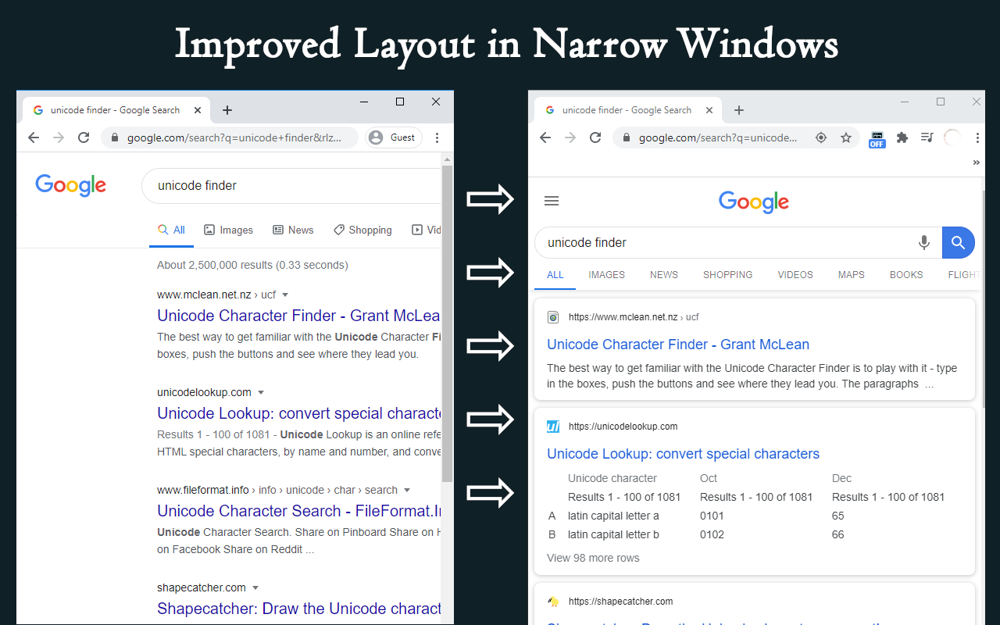
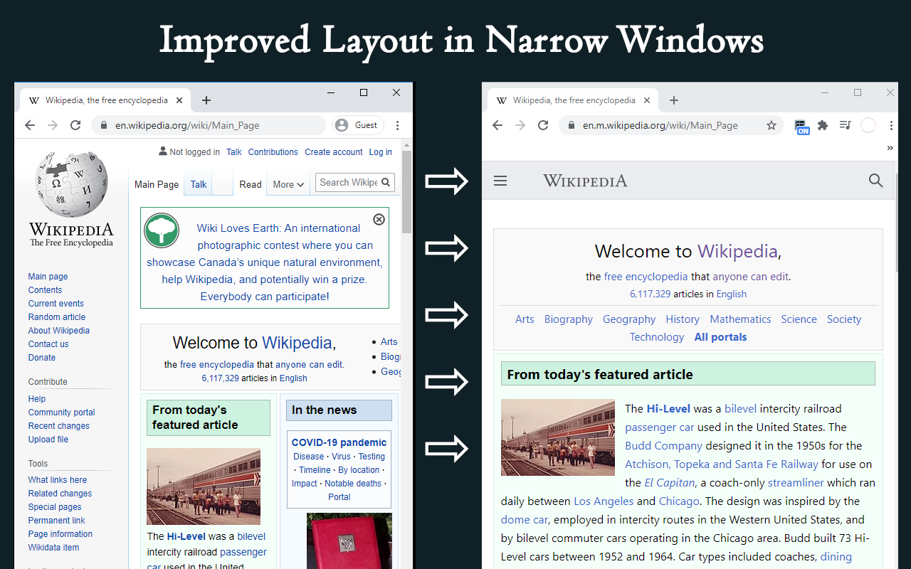
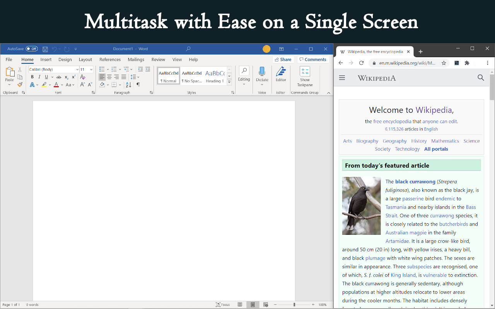

################################
Sideview Plus Browser Extension
################################

A browser extension to improve web layouts for multitasking. It allows doing a quick google search or checking out a link without leaving the current tab; improves the layout on narrow windows by requesting the mobile version automatically; and includes intuitive but granular customization. The extension has garnered over 5000 users with 4.5+/5 ratings across platforms.

+-------------------------------------------------------------+---------------------------------------------------------------------------------------------------------------------------------------------+-----------------------------------------------------------------------------------------------------------------------------------------------------------+
|   `Homepage <https://parimalam.me/pages/sideview.html>`_    |   `Link to MS Edge Add-ons <https://microsoftedge.microsoft.com/addons/detail/sideview-plus-multitask-/ngocckbdkjpgidpachimbiaphcgjgoaa>`_  | `Link to Chrome Web Store <https://chrome.google.com/webstore/detail/sideview-plus-multitask-w/cgkfhhagdgcjcjdkcbpohhhidlibblkn?utm_source=portfolio>`_   | 
+-------------------------------------------------------------+---------------------------------------------------------------------------------------------------------------------------------------------+-----------------------------------------------------------------------------------------------------------------------------------------------------------+

